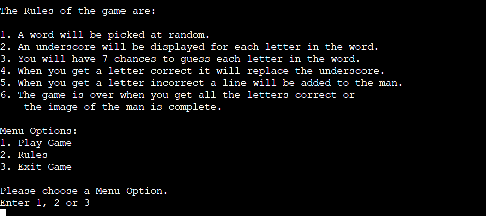

# Hangman

Click [here](https://hangman-soro82-05b97f95a765.herokuapp.com) for the live link.

## Introduction

The Hangman game is a Python command-line project. It is written in Python and deployed using Heroku. A word is picked at random and the user has seven chances to guess the correct letters in the word. The word is displayed with an underscore in place of each letter in the word.If the user guesses a correct letter, the underscore for that letter is replaced with the letter. If the user guesses an incorrect letter, the next image of the hangman is displayed and the user is told how many lives they have left. 

## Table of Contents

* [User Stories](#user-stories)
* [Flowcharts](#flowcharts)
   * [Run Game](#run-game)
   * [Get User's Answer](#get-users-answer)
   * [Play Game](#play-game)
* [Features](#features)
* [Testing](#testing)
* [Deployment](#deployment)
* [Credits](#credits)

## User Stories

As a user I want to be able to:

* enter my name before I start the game.
* choose from a list of options.
* start the game.
* see the rules of the game.
* Exit the game.
* know how many letters are in the word to guess.
* know how many lives I have left after each guess.
* be told when I get an answer correct.
* see my correct answers in their correct position in the word.
* be told when I get an answer incorrect.
* see an image of the hangman after each incorrect answer.
* be told when I correctly guessed all the letters in the word.
* know if I previously guessed the letter.
* know when the game is over.
* to choose to play again or exit the game.

[Back to Top](#hangman)

## Flowcharts

I used [Lucidchart](https://www.lucidchart.com/pages/) to create the flowcharts for my game. I found them really helpful in planning what functions I need for the game to work in the way that I wanted it to.

### Run Game

I created my first flowchart to plan out the basic operations of the game.

* Display the welcome message and menu options.
* Ask the user to choose a menu option.
* Validate the user's input.
* what each menu option does.

[Back to Top](#hangman)

### Get User's Answer

Next I created a flowchart to plan how to get the answer from the user and what to do with it.

* Ask the user to choose a letter.
* Check if the user has entered a letter.
* Inform the user if they did not enter a single letter.
* If the user enters a valid input, check if the answer is correct.
* If it's incorrect, display the next hangman image.
* If it's correct, find the index of the user's answer.
* Display the word with the user's answer in it.

[Back to Top](#hangman)

### Play Game

At first I had a separate function to check the user's answer but I realized that I needed to do it in the same function that loops through the game so I created the play_game flowchart. Here I:

* Print the word in question.
* Ask the user to choose a letter.
* Validate the input.
* Check if the letter was asked previously.
* Display the images.

[Back to Top](#hangman)

## Features

### Get User's Name

* Ask the user to enter their name.
* Inform the user if they enter and invalid entry.

### Menu Options

* Display Menu Options.
* Display the User's Name.
* Ask the user to choose a menu option.

* Validate the Menu Option chosen by the user.

### Display Rules

### Start Game

* Display underscores for each letter in the word.
* Display the number of lives the user has left.

### User Answers

* Answer Validation

* First Correct Answer

* Answer Tried Previously

* Second Correct Answer

### Incorrect Answers

* First Incorrect Answer

* Second Incorrect Answer

* Third Incorrect Answer

* Fourth Incorrect Answer

* Fifth Incorrect Answer

* Sixth Incorrect Answer

### Game Over

* Final Correct Answer

* Final Incorrect Answer

