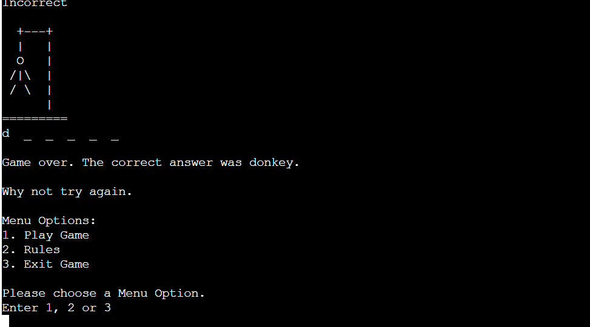
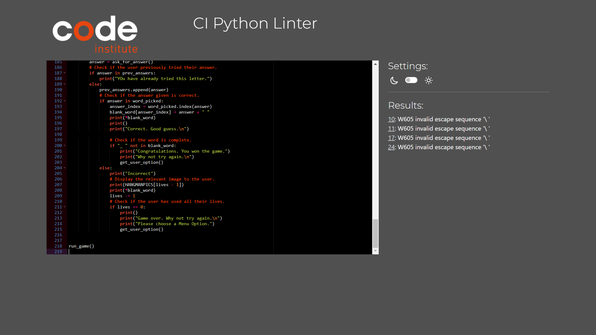

# Hangman

Click [here](https://hangman-soro82-05b97f95a765.herokuapp.com) for the live link.

## Introduction

The Hangman game is a Python command-line project. It is written in Python and deployed using Heroku. A word is picked at random and the user has seven chances to guess the correct letters in the word. The word is displayed with an underscore in place of each letter in the word.If the user guesses a correct letter, the underscore for that letter is replaced with the letter. If the user guesses an incorrect letter, the next image of the hangman is displayed and the user is told how many lives they have left. 

## Table of Contents

* [User Experience](#user-experience)
   * [Project Goals](#project-goals)
   * [User Stories](#user-stories)
* [Flowcharts](#flowcharts)
   * [Run Game](#run-game)
   * [Get User's Answer](#get-users-answer)
   * [Play Game](#play-game)
* [Features](#features)
   * [Get User's Name](#get-users-name)
   * [Menu Options](#menu-options)
   * [Display Rules](#display-rules)
   * [Start Game](#start-game)
   * [User Answer](#user-answers)
   * [Incorrect Answers](#incorrect-answers)
   * [Game Over](#game-over)
* [Testing](#testing)
   * [Bugs](#bugs)
   * [Validation](#validator-testing)
* [Deployment](#deployment)
   * [Forking](#forking)
   * [Cloning](#cloning)
* [Credits](#credits)

## User Experience

### Project Goals

* To create a game that is easy and fun to use.
* To provide feedback to the user when they enter invalid data.
* To show the user where their correct answers are in the word.
* To display images of the hangman at each stage of the game.
* To inform the user of how many chances they have to guess the word.
* To allow the user to view the rules of the game if they wish.
* To congratulate the user when they win.
* To allow the user to play again if they win or lose.

### User Stories

As a user I want to be able to:

* enter my name before I start the game.
* choose from a list of options.
* start the game.
* see the rules of the game.
* Exit the game.
* know how many letters are in the word to guess.
* know how many lives I have left after each guess.
* be told when I get an answer correct.
* see my correct answers in their correct position in the word.
* be told when I get an answer incorrect.
* see an image of the hangman after each incorrect answer.
* be told when I correctly guessed all the letters in the word.
* know if I previously guessed the letter.
* know when the game is over.
* to choose to play again or exit the game.

[Back to Top](#hangman)

## Flowcharts

I used [Lucidchart](https://www.lucidchart.com/pages/) to create the flowcharts for my game. I found them really helpful in planning what functions I need for the game to work in the way that I wanted it to.

### Run Game

I created my first flowchart to plan out the basic operations of the game.

* Display the welcome message and menu options.
* Ask the user to choose a menu option.
* Validate the user's input.
* what each menu option does.

[Back to Top](#hangman)

### Get User's Answer

Next I created a flowchart to plan how to get the answer from the user and what to do with it.

* Ask the user to choose a letter.
* Check if the user has entered a letter.
* Inform the user if they did not enter a single letter.
* If the user enters a valid input, check if the answer is correct.
* If it's incorrect, display the next hangman image.
* If it's correct, find the index of the user's answer.
* Display the word with the user's answer in it.

[Back to Top](#hangman)

### Play Game

At first I had a separate function to check the user's answer but I realized that I needed to do it in the same function that loops through the game so I created the play_game flowchart. Here I:

* Print the word in question.
* Ask the user to choose a letter.
* Validate the input.
* Check if the letter was asked previously.
* Display the images.

[Back to Top](#hangman)

## Features

### Get User's Name

* Ask the user to enter their name.
* Inform the user if they enter and invalid entry.

[Back to Top](#hangman)

### Menu Options

* Display Menu Options.
* Display the User's Name.
* Ask the user to choose a menu option.

* Validate the Menu Option chosen by the user.

[Back to Top](#hangman)

### Display Rules

[Back to Top](#hangman)

### Start Game

* Display underscores for each letter in the word.
* Display the number of lives the user has left.

[Back to Top](#hangman)

### User Answers

User Answers

* Answer Validation

* First Correct Answer

* Answer Tried Previously

* Second Correct Answer

### Incorrect Answers

Incorrect Answers

* First Incorrect Answer

* Second Incorrect Answer

* Third Incorrect Answer

* Fourth Incorrect Answer

* Fifth Incorrect Answer

* Sixth Incorrect Answer

### Game Over

* Final Correct Answer

* Final Incorrect Answer

[Back to Top](#hangman)

## Testing

| Location | Test | Expected Result | Result |
| :------: | :--: | :-------------: | :----: |
| Enter User's Name | Enter a number | Inform user that it must be all letters | Passed |
| Enter User's Name | Enter a single letter | Inform user that it must be at least 2 letters | Passed |
| Enter User's Name | Enter numbers and letters | Inform user that it must be all letters | Passed |
| Menu Options | Capitalize user's name | Display user's name capitalized | Passed |
| Enter Menu Option | Enter a number greater than 3 | Inform user to enter 1, 2 or 3 | Passed |
| Enter Menu Option | Enter letters | Inform user to enter 1, 2 or 3 | Passed |
| Enter Menu Option | Enter numbers and letters | Inform user to enter 1, 2 or 3 | Passed |
| Enter Menu Option | Enter a symbol | Inform user to enter 1, 2 or 3 | Passed |
| Display Rules | | Rules are less than 80 characters wide | Passed |
| Display Rules | | Ask the user to choose a menu option | Passed |
| Display Rules | Enter a number greater than 3 | Inform user to enter 1, 2 or 3 | Passed |
| Display Rules | Enter letters | Inform user to enter 1, 2 or 3 | Passed |
| Display Rules | Enter numbers and letters | Inform user to enter 1, 2 or 3 | Passed |
| Play Game | Generate random number between 0 and 9 | Random number generated | Passed |
| Play Game | | get word from list using random number as index | Passed |
| Play Game | Get length of random word | Print underscore for each letter in word | Passed |
| Play Game | Lives start at 7 | Display number of lives left | Passed |
| Play Game | Enter a number | Inform user to enter a single letter | Passed |
| Play Game | Enter 2 letters | Inform user to enter a single letter | Passed |
| Play Game | Enter multiple letters | Inform user to enter a single letter | Passed |
| Play Game | Enter numbers and letters | Inform user to enter a single letter | Passed |
| Play Game | Enter a symbol | Inform user to enter a single letter | Passed |
| Play Game | User enters a correct answer | Display user's answer in correct position | Passed |
| Play Game | Enter a letter previously entered | Inform user letter was previously entered | Passed |
| Play Game | User enters first incorrect answer | Display correct image | Passed |
| Play Game | User enters incorrect answer | Number of lives reduce by 1 | Passed |
| Play Game | User enters second incorrect answer | Display correct image | Passed |
| Play Game | User enters third incorrect answer | Display correct image | Passed |
| Play Game | User enters fourth incorrect answer | Display correct image | Passed |
| Play Game | User enters fifth incorrect answer | Display correct image | Passed |
| Play Game | User enters sixth incorrect answer | Display correct image | Passed |
| Game Over | User enters last incorrect answer | Display correct image | Passed |
| Game Over | User enters last incorrect answer | Inform user the game is over | Passed |
| Game Over | User enters last incorrect answer | Ask user to choose a menu option | Passed |
| Game Over | User enters last correct answer | Inform the user that they won | Passed |
| Game Over | User enters last correct answer | Display all letters in correct positions | Passed |
| Game Over | User enters last correct answer | Ask user to choose a menu option | Passed |
| Game Over | User chooses menu option 1 | A new game starts | Passed |
| Game Over | User chooses menu option 2 | The rules are displayed | Passed |
| Game Over | User chooses menu option 3 | The program stops | Passed |

[Back to Top](#hangman)

### Bugs

##### Fixed Bugs

| Bug | Solution | Result |
| :-: | :-------: | :----: |
| Asks for user's name after displaying rules | Add function to get user's name | Fixed |
| Images displaying in reverse order | Change order of images in list | Fixed |
| Lives reducing when answer previously asked | Add if statement to while loop | Fixed |
| Last image not displayed | Increase lives from 6 to 7 | Fixed |
| Underscores displayed twice when game replayed | Clear blank_word in get_user_option function | Fixed |

##### Unfixed Bugs

* There are no unfixed bugs.

[Back to Top](#hangman)

### Validator Testing

* The game was tested using Code Institute's Pep8 Python Validator

[Back to Top](#hangman)

## Deployment

The game was deployed using [Heroku](https://www.heroku.com/) through the following steps.

1. Log in to Heroku or create an account if necessary.
2. Click on the button labeled "New" from the dashboard in the top right corner and select the "Create new app" option in the drop-down menu.
3. Enter a unique name for the application and select the region you are in.
4. Click on "create app".
5. Navigate to the settings tab and locate the "Config Vars" section and click "Reveal config vars".
6. To add a config var:
   * In the "KEY" field:
      * enter PORT in all capital letters.
   * In the "VALUE" field:
      * enter 8000 and click "Add".
8. Scroll to the "Buildpacks" section and click "Add buildpack".
9. Select Python and save changes.
10. Add another buildpack and select Nodejs then save changes again.
11. Ensure that the python buildpack is above the Nodejs buildpack.
12. Navigate to the "Deploy" section by clicking the "Deploy" tab in the top navbar.
13. Select "GitHub" as the deployment method and click "Connect to GitHub".
14. Search for the GitHub repository name in the search bar.
15. Click on "connect" to link the repository to Heroku.
16. Scroll down and click on "Deploy Branch".
17. Once the app is deployed, Heroku will notify you and provide a button to view the app.
18. Click on "Enable Automatic Deploys" to rebuild the deployed app automatically every time you push to GitHub.

Click [here](https://hangman-soro82-05b97f95a765.herokuapp.com) for the live link.

[Back to Top](#hangman)

### Forking

Forking is a way to make a copy of the original repository on your GitHub account to view and change without affecting the original repository.

* Log in to GitHub and locate your GitHub Repository.
* At the top of the Repository(under the main navigation) locate the "Fork" button.
* Now you should have a copy of the original repository in your GitHub account.

### Cloning

* Log in to GitHub and locate the GitHub Repository.
* Under the repository name click "Clone or download".
* Click on the code button, select clone with HTTPS, SSH or GitHub CLI and copy the link shown.
* Open Git Bash.
* Change the current working directory to the location where you want the cloned directory to be made.
* Type git clone and then paste The URL copied in step 3.
* Press Enter and your local clone will be created.

[Back to Top](#hangman)

## Credits

* I copied the images for game from https://gist.github.com/chrishorton/8510732aa9a80a03c829b09f12e20d9c.
* I used Code Institute's Pep8 Python Validator https://pep8ci.herokuapp.com/ to validate the code.

[Back to Top](#hangman)
